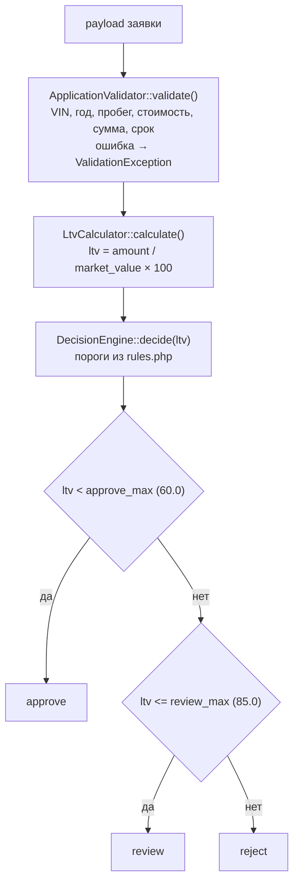

# Карта кода: как считается решение approve / review / reject

Разбор по `backend/src/Domain/` и `backend/config/rules.php`. Ничего не менялось, только чтение. Все числа учебные, синтетические.

## 1. Участники

| Файл | Роль |
|---|---|
| `backend/config/rules.php` | Единственное хранилище бизнес-чисел: пороги VIN, года/пробега, суммы, срока, LTV |
| `backend/src/AppFactory.php` | Сборка (вне Domain, но единственная точка, где `rules.php` попадает в Domain): строки 27–39 — `require rules.php`, затем `new ApplicationValidator($rules, new VinValidator($rules['vin']), new VehicleAge((int) date('Y')))`, `new LtvCalculator()`, `new DecisionEngine($rules['ltv'])`, `new VehicleAge(...)` |
| `backend/src/Domain/AssessmentService.php` | Оркестратор: `assess()` — валидация → LTV → решение → ответ |
| `backend/src/Domain/ApplicationValidator.php` | Валидация и нормализация заявки |
| `backend/src/Domain/VinValidator.php` | Проверка формата VIN |
| `backend/src/Domain/VehicleAge.php` | Возраст авто: `currentYear - productionYear` |
| `backend/src/Domain/LtvCalculator.php` | Расчёт LTV |
| `backend/src/Domain/DecisionEngine.php` | Единственное место, где рождается решение |
| `backend/src/Domain/ValidationException.php` | Ошибка валидации (поле → сообщение) |

## 2. Порядок вызовов — всё внутри `AssessmentService::assess(array $payload)`

1. **`ApplicationValidator::validate($payload)`** — по одной проверке на поле; при любой ошибке коллекция `$errors` уходит в `ValidationException`, и заявка до расчёта решения **не доходит**:
   - VIN → `VinValidator::isValid()`: 17 символов, `A-Z0-9`, без `I/O/Q` (из `rules['vin']`);
   - год: `VehicleAge::inYears($year)`, затем `year >= 1990` (`vehicle.min_year`), возраст >= 0 (не из будущего), возраст <= 20 (`vehicle.max_age_years`);
   - пробег: `0 <= mileage <= 500000` (`vehicle.max_mileage_km`);
   - `market_value > 0`;
   - `requested_amount` 50 000…2 000 000 (`amount.min/max`);
   - `term_months` 3…48 (`term.min_months/max_months`).

   Возвращает нормализованный массив `{vin, year, mileage, market_value, requested_amount, term_months}`.
2. **`LtvCalculator::calculate(requested_amount, market_value)`** — `round(amount / market_value * 100, 2)`; при `market_value <= 0` или `amount <= 0` — `InvalidArgumentException`.
3. **`DecisionEngine::decide($ltv)`** — пороги из `rules['ltv']` (`approve_max = 60.0`, `review_max = 85.0`):
   - `$ltv < 60.0` → `approve`;
   - `60.0 <= $ltv <= 85.0` → `review`;
   - `$ltv > 85.0` → `reject`.
4. Сборка ответа: `vehicle_age` (снова `VehicleAge::inYears`), `ltv`, `decision`, `approved_limit` (= `requested_amount` при approve, иначе 0) и исходный `input`.

Два факта по границам:

- **Решение зависит только от LTV.** Пробег, год и срок на него не влияют — они лишь пропуск/отбой на валидации. Справочник `ltv_by_age` тоже не участвует: лимит по нему не считается (задача LOAN-12, отмечено в док-блоке `AssessmentService`).
- Расхождение док-блока с кодом: и в `rules.php` (строки 39–41), и в док-блоке `DecisionEngine` написано `LTV <= approve_max -> approve`, но в коде (строка 32) строгое `<`. При LTV ровно 60.0 фактическое решение — `review`.

## 3. Куда встанет правило «пробег <= 400 000 км, иначе review»

Это правило уровня **решения**, а не валидации (оно не отбивает заявку, а меняет вердикт). В текущей архитектуре кандидатов ровно два места:

**Вариант A — внутри `DecisionEngine::decide()`** (DecisionEngine.php, строки 30–41). Логичнее: весь код решения в одном классе. Что для этого нужно:

- расширить сигнатуру: `decide(float $ltv, int $mileage)` — место проверки: первой веткой при входе в метод («если пробег выше порога → REVIEW») либо после LTV-веток как переопределение; выбор места зависит от семантики (см. ниже);
- добавить порог в конструктор (сейчас туда приходят только `approve_max`/`review_max`);
- обновить вызов в `AssessmentService::assess()`, строка 33: `decide($ltv, $input['mileage'])`;
- поправить тесты: `tests/Unit/DecisionEngineTest.php` вызывает `decide($ltv)` напрямую (строки 23–35).

**Вариант B — в `AssessmentService::assess()` сразу после строки 33.** Получить `$decision` от движка и переопределить на `review` при пробеге выше порога. `DecisionEngine` остаётся чистой функцией от LTV, но логика решения расползается на два класса.

Порог 400 000 по конвенциям проекта нельзя хардкодить — нужен **новый ключ в `rules.php`** (например, в секции `vehicle`). Существующий `vehicle.max_mileage_km = 500000` не подходит: это потолок валидации, а не порог review.

**Входные данные, которые уже есть:**

- `mileage` — есть во всей цепочке: поле в payload → нормализуется и валидируется в `ApplicationValidator` (int, 0…500 000) → лежит в `$input` внутри `assess()` → уходит в ответ (`input`) и в БД (`ApplicationRepository`, колонка `mileage_km`). На фронтенде поле тоже есть (`frontend/index.html`, строка 31: `type="number"`, `required`). Отдельно запрашивать нечего — всё необходимое для проверки уже есть.

**Чего не хватает:**

- Порога 400 000 в `rules.php` — нет, ключа с таким значением нет нигде.
- Доступа к пробегу внутри `DecisionEngine` — нет: `decide()` принимает только `float $ltv`, конструктор — только ltv-пороги.
- Механизма комбинирования правил — нет: сегодня решение — чистая функция одного аргумента. В коде нет ничего, что определяло бы приоритет «review по пробегу» против «reject по LTV» (перекрывает ли большой пробег reject или только понижает approve) — семантику надо определить при добавлении правила.
- Тестов на пробег как фактор решения — нет: в `tests/` пробег встречается только как валидные фикстуры (96 000 и 84 000 км), поведенческих проверок нет.

**Границы срабатывания:** «не больше 400 000» — при пробеге ровно 400 000 заявка проходит правило; review — при 400 001+. Реально новое правило может сработать только в диапазоне **400 001…500 000 км**: всё, что выше 500 000, отбивается ещё в `ApplicationValidator` с `ValidationException` и до решения не доходит.

## 4. Что в коде сейчас проверяется про пробег

- **Единственная проверка** — в `ApplicationValidator::validate()`, строки 43–46: `(int) mileage`, значение по умолчанию `-1` (отсутствующее поле → ошибка); условие `mileage < 0 || mileage > rules['vehicle']['max_mileage_km']` → ошибка «Пробег от 0 до 500000 км» → `ValidationException`, заявка не оценивается.
- **Порог в конфиге** — `rules.php`, строка 23: `'max_mileage_km' => 500000`.
- **Больше ничего:** в расчёт LTV пробег не входит, на решение не влияет, в `ltv_by_age` не участвует, в `VinValidator`/`DecisionEngine`/`LtvCalculator` упоминаний нет. После валидации пробег просто пробрасывается дальше: в `$input` (`AssessmentService`), в ответ `input` и в БД (`ApplicationRepository.mileage_km`).
- На фронтенде проверок диапазона нет — только `required` и `type="number"` в HTML.
